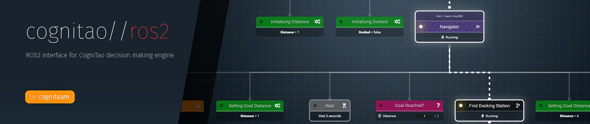

# CogniTao Examples


## WorldModel Monitor
* cognitao_wmm is a program installed by default along cognitao_server
* Using cognitao_wmm it is possible to create a local synchronized world model through a ros2 datasource
```
export COGNITAO_DATASOURCE="ros2"
cognitao_wmm
```
* This will make available a topic /wme/in
* Through this topic it is possible to listen and publish world model key/value events


## Wait example

* In this example we are going to create a server for one or more wait action requests.
* To do so we extend RosActionServer [RosActionServer header](include/RosActionWaitServer.h)
  and implement it's execute method [RosActionServer cpp](src/RosActionWaitServer.cpp)
```
void RosActionWaitServer::execute(RosActionContext action) {

    // get parameters
    for(auto param : action.getParameters())
    {
        cout << param.first <<  << endl;
    }
    
    while( /* check condition*/)
    {
        // do some work
        std::this_thread::sleep_for(std::chrono::milliseconds(1000));

        // check if should stop
        // cancel goal
        if (ros2ActionContext.isPreemptRequested() ) {             
            ros2ActionContext.cancelGoal();            
            return;
        }      
 
    }

    // return when done
    action.setResult(true);
}
```


* In the execute method 
  * we can use action.getParameters() to get the actions parameters from the XML
  * we can use action.isPreemptRequested() to query if this remote goal needs to be stopped
  * we can use action.setResult(true/false) to set the return value
* Now we will define an XML that will invoke this action on the server [XML](assets/machines/wait_example.xml)
  * WE ASSUME YOU HAVE INSTALLED COGNITAO_ROS PLUGINS
```
<machine name="testBT" type="bt">
	<task name="wait" runner="ros" action="wait" param_time="10.0"/>
</machine>
```
* Now you can compile this project using catkin and should be able to run
```
rosrun cognitao_ros action_wait_server 
``` 
* This server will connet to your ros_master and wait for a goal
* From another terminal run 
```
export COGNITAO_DATASOURCE="ros"
cognitao_server assets/wait_example.xml
```
* This will load a plan that will invoke an action in the wait server 
* Actions can run in parrallel, are remotely monitored and preempted if needed

## Build status
[](https://git.cogni.io/cognitao/cognitao_examples/commits/master) **master**

[](https://git.cogni.io/cognitao/cognitao_examples/commits/master) **develop**

